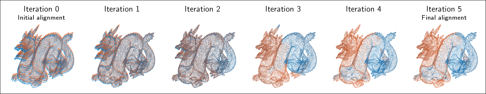

# simpleICP



This repo contains implementations of a rather simple version of the [Iterative Closest Point (ICP) algorithm](https://en.wikipedia.org/wiki/Iterative_closest_point) in various languages.

Currently, an implementation is available for:

| Language | Code | Main dependencies |
| --- | --- | --- |
| C++ | [Link](c++) | [nanoflann](https://github.com/jlblancoc/nanoflann), [Eigen](http://eigen.tuxfamily.org), [cxxopts](https://github.com/jarro2783/cxxopts) |
| Julia | [Link](julia) | [NearestNeighbors.jl](https://github.com/KristofferC/NearestNeighbors.jl) |
| Matlab | [Link](matlab) | [Statistics and Machine Learning Toolbox](https://www.mathworks.com/products/statistics.html) |
| Octave | [Link](octave) | |
| Python | [Link](python) | |

I've tried to optimize the readability of the code, i.e. the code structure is as simple as possible and tests are rather rare.

The C++ version can be used through a cli interface.


Also available at:

[](https://www.mathworks.com/matlabcentral/fileexchange/81273-simpleicp)

## Features of the ICP algorithm

- Usage of the signed **point-to-plane distance** (instead of the point-to-point distance) as error metric. Main reasons:
  - higher convergence speed, see e.g. [here](https://www.youtube.com/watch?v=LcghboLgTiA) and [here](https://ieeexplore.ieee.org/abstract/document/924423)
  - better final point cloud alignment (under the assumption that both point clouds are differently sampled, i.e. no real point-to-point correspondences exist)
- Estimation of a **rigid-body transformation** (rotation + translation) for the movable point cloud. The final transformation is given as homogeneous transformation matrix H:
  ```
  H = [R(0,0) R(0,1) R(0,2)   tx]
      [R(1,0) R(1,1) R(1,2)   ty]
      [R(2,0) R(2,1) R(2,2)   tz]
      [     0      0      0    1]
  ```
  where ``R`` is the rotation matrix and ``tx``, ``ty``, and ``tz`` are the components of the translation vector. Using ``H``, the movable point cloud can be transformed with:
  ```
  Xt = H*X
  ```
  where ``X`` is a 4-by-n matrix holding in each column the homogeneous coordinates ``x``, ``y``, ``z``, ``1`` of a single point, and ``Xt`` is the resulting 4-by-n matrix with the transformed points.
- Selection of a **fixed number of correspondences** between the fixed and the movable point cloud. Default is ``correspondences = 1000``.
- Automatic **rejection of potentially wrong correspondences** on the basis of 
  1. the [median of absolute deviations](https://en.wikipedia.org/wiki/Median_absolute_deviation). A correspondence ``i`` is rejected if ``|dist_i-median(dists)| > 3*sig_mad``, where ``sig_mad = 1.4826*mad(dists)``.
  2. the planarity of the plane used to estimate the normal vector (see below). The planarity is defined as ``P = (ev2-ev3)/ev1`` (``ev1 >= ev2 >= ev3``), where ``ev`` are the eigenvalues of the covariance matrix of the points used to estimate the normal vector. A correspondence ``i`` is rejected if ``P_i < min_planarity``. Default is ``min_planarity = 0.3``.
- After each iteration a **convergence criteria** is tested: if the mean and the standard deviation of the point-to-plane distances do not change more than ``min_change`` percent, the iteration is stopped. Default is ``min_change = 1``.
- The normal vector of the plane (needed to compute the point-to-plane distance) is estimated from the fixed point cloud using a fixed number of neighbors. Default is ``neighbors = 10``.

## Output

All implementations generate the same output. This is an example from the C++ version for the *Dragon* dataset:

```
> run_simpleicp
[10:34:10.277] Create point cloud objects ...
[10:34:10.278] Select points for correspondences in fixed point cloud ...
[10:34:10.278] Estimate normals of selected points ...
[10:34:10.291] Start iterations ...
[10:34:10.310] Iteration | correspondences | mean(residuals) |  std(residuals)
[10:34:10.310]         0 |             984 |          0.0388 |          0.3160
[10:34:10.310]         1 |             984 |          0.0011 |          0.2520
[10:34:10.327]         2 |             996 |          0.0014 |          0.1630
[10:34:10.342]         3 |             993 |          0.0059 |          0.0751
[10:34:10.357]         4 |             974 |          0.0007 |          0.0148
[10:34:10.373]         5 |             980 |          0.0001 |          0.0021
[10:34:10.388]         6 |             996 |          0.0001 |          0.0021
[10:34:10.404] Convergence criteria fulfilled -> stop iteration!
[10:34:10.404] Estimated transformation matrix H:
[10:34:10.404] [    0.998657     0.052625    -0.034241    -0.204408]
[10:34:10.404] [   -0.052121     0.998995     0.019899    -0.407677]
[10:34:10.404] [    0.034893    -0.018484     0.999439    -0.594463]
[10:34:10.404] [    0.000000     0.000000     0.000000     1.000000]
[10:34:10.404] Finished in 0.127 seconds!
```

## Test data sets

The test data sets are included in the [data](data) subfolder. An example call for each language can be found in the ``run_simpleicp.*`` files, e.g. [run_simpleicp.py](python/run_simpleicp.py) for the python version.

| Dataset | | PC1 (no_pts) | PC2 (no_pts) | Source |
| :--- | --- | --- | --- | --- |
| *Dragon* |  | [``dragon1.xyz``](data/dragon1.xyz) (100k) | [``dragon2.xyz``](data/dragon2.xyz) (100k) | [The Stanford 3D Scanning Repository](http://graphics.stanford.edu/data/3Dscanrep/) |
| *Airborne Lidar* |  | [``airborne_lidar1.xyz``](data/airborne_lidar1.xyz) (1340k) | [``airborne_lidar2.xyz``](data/airborne_lidar2.xyz) (1340k) | Airborne Lidar fligth campaign over Austrian Alps |
| *Terrestrial Lidar* |  | [``terrestrial_lidar1.xyz``](data/terrestrial_lidar1.xyz) (1250k) | [``terrestrial_lidar2.xyz``](data/terrestrial_lidar2.xyz) (1250k) | Terrestrial Lidar point clouds of a stone block|

### Benchmark

These are the runtimes on my PC for the data sets above:

| Dataset | C++ | Julia | Matlab | Octave* | Python |
| :--- | ---: | ---: | ---: | ---: | ---: |
| *Dragon*            | 0.13s | 0.40s |  0.72s | 83.7s |  0.45s |
| *Airborne Lidar*    | 4.08s | 5.04s | 19.80s | -     | 73.39s |
| *Terrestrial Lidar* | 3.25s | 4.49s | 20.01s | -     |  6.20s |

For all input parameters (``correspondences``, ``neighbors``, ...) the default values have been used.

**\*** Unfortunately, I haven't found an implementation of a kd tree in Octave (it is not yet implemented in the [Statistics](https://wiki.octave.org/Statistics_package) package). Thus, a (very time-consuming!) exhaustive nearest neighbor search is used instead. For larger datasets the Octave timings are missing, as the distance matrix does not fit into memory.

## References

Please cite related papers if you use this code:
```
@article{glira2015a,
  title={A Correspondence Framework for ALS Strip Adjustments based on Variants of the ICP Algorithm},
  author={Glira, Philipp and Pfeifer, Norbert and Briese, Christian and Ressl, Camillo},
  journal={Photogrammetrie-Fernerkundung-Geoinformation},
  volume={2015},
  number={4},
  pages={275--289},
  year={2015},
  publisher={E. Schweizerbart'sche Verlagsbuchhandlung}
}
```

## Related projects

- [globalICP](https://github.com/pglira/Point_cloud_tools_for_Matlab): A multi-scan ICP implementation for Matlab

## Todo

- [ ] Add outline of the algorithm
- [ ] Consider partial overlap of point clouds
